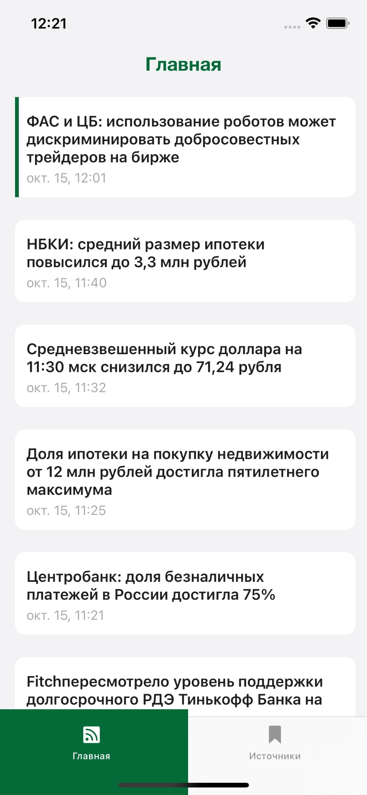
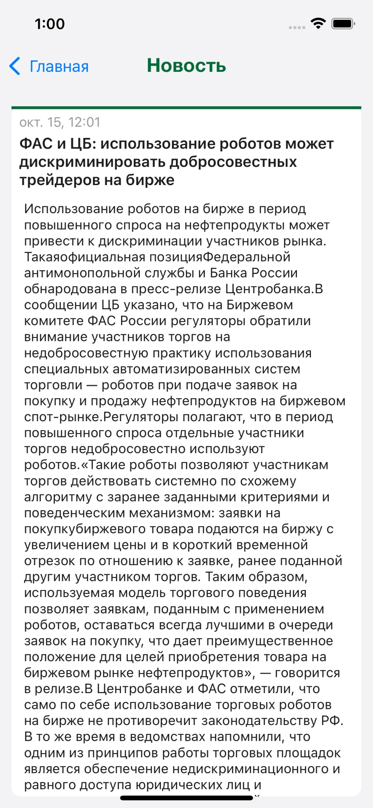
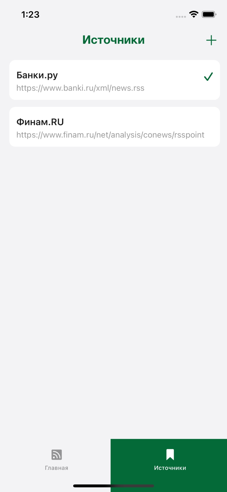

# Тестовое приложение SberRSSTask
Мобильное приложение для просмотра новостной ленты с использованием RSS-источников.
## Особенности приложения
 - архитектура MVVM;
 - программная реализация интерфейса через код и адаптация UI под различные размеры экрана;
 - сохранение новостей в CoreData и возможность просмотра их при отстутствии подключения к интернету;
 - добавление новостных источников.
## Функционал приложения
### Просмотр RSS-ленты
 На главном экране приложения представлена новостная лента. 

 

После успешного запроса на экране будет представлен список новостей, с которым пользователь может взаимодействовать. А именно:
  - при нажатии на новость откроется экран с подробными сведениями;
  - при нажатии на новость она получит отметку, как прочитанная.
  
 

Текущие новости сохраняются в CoreData и если запустить приложение без доступа к интернету, то загрузятся последние новости с отметками о том, какие из них уже были прочитаны.
### Добавление источника RSS
На данном экране представлены доступные RSS-источники, а также есть возможность добавить свой и выбрать его, как активный.
При добавлении присутствует валидация адреса с помощью регулярного выражения. Имя источника также должно состоять из более 3 букв.
Информация о RSS-источниках хранится в UserDefaults.

 

